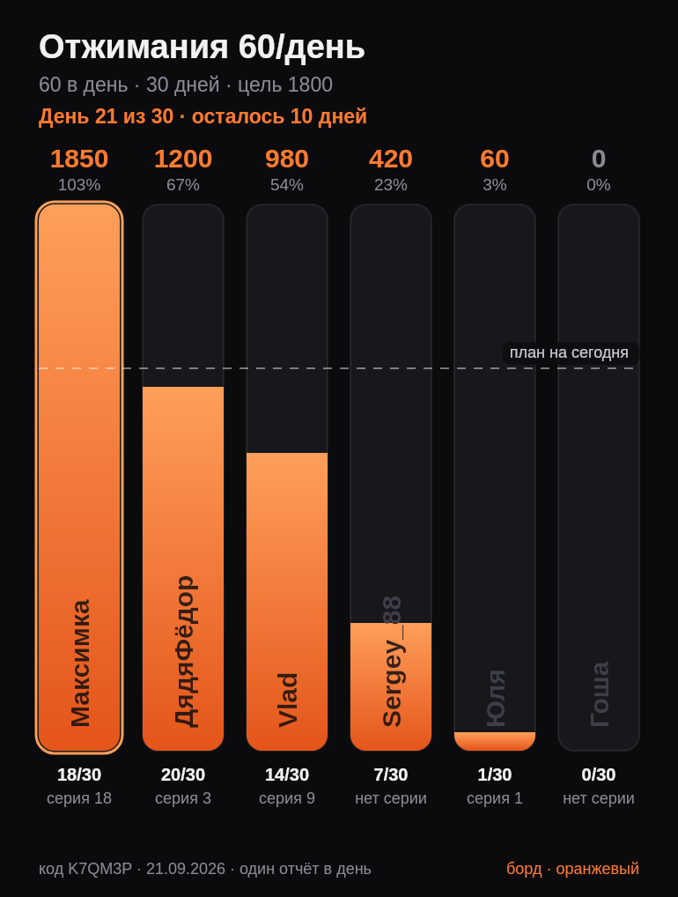

# Бот-лидерборд челленджа по отжиманиям

Телеграм-бот, который ведёт лидер-борды челленджей по отжиманиям: инициатор бросает
вызов, участники каждый день присылают скриншот из приложения с числом отжиманий,
бот рисует столбчатый график и раздаёт бейджи.



## Что умеет

* **Вызов на ограниченный круг** — максимум **6 участников** в челлендже, включая инициатора.
* **До 3 лидер-бордов одновременно** у одного человека: первый борд оранжевый,
  второй зелёный, третий голубой. Освободившийся цвет переиспользуется.
* **Срок и норма задаются вручную**: N отжиманий в день × D дней = цель челленджа.
* **Отчёт — скриншот + число.** Скриншот из приложения обязателен, количество берётся
  из подписи к фото (или бот спросит числом следующим сообщением).
* **Не больше одного отчёта в день.** Второй отчёт за тот же день бот не принимает —
  так не получается «догнать» пропуски задним числом.
* **Столбик = 100% цели.** Высота дорожки — вся цель челленджа, заливка растёт по мере
  отчётов, ник стоит внутри столбика неподвижно и не уезжает вместе с заливкой.
  Пунктир «план на сегодня» показывает, кто отстаёт от графика.
* **Итоги челленджа**: кто выполнил план, кому сколько отжиманий не хватило.
  Перевыполнившие борются за звание чемпиона — побеждает наибольшая сумма
  (при равенстве чемпионов несколько).
* **Бейджи**: серии 3, 7, 10, 14, 21, 30, 60, 100, 150, 200 и 365 дней подряд,
  а также «Чемпион», «Финишер» и «Лузер».

## Быстрый старт

```bash
cd bot
cp .env.example .env      # вставь токен от @BotFather в BOT_TOKEN
npm install
npm start
```

Требуется Node.js 22.18+ (бот запускается прямо из TypeScript, без сборки).

Переменные окружения (`.env`):

| Переменная | По умолчанию | Зачем |
| --- | --- | --- |
| `BOT_TOKEN` | — | токен от [@BotFather](https://t.me/BotFather) |
| `CHALLENGE_TIMEZONE` | `Europe/Moscow` | по какому поясу считается «день» челленджа |
| `DATA_FILE` | `bot/data/db.json` | файл с данными |

## Команды

| Команда | Что делает |
| --- | --- |
| `/new` | бросить вызов: название → срок → норма в день → ник |
| `/join КОД` | принять вызов и выбрать ник |
| `/begin КОД` | запустить челлендж (только инициатор, нужен хотя бы один соперник) |
| `/board [КОД]` | прислать картинку лидер-борда |
| `/boards` | список моих челленджей и занятых слотов |
| `/nick КОД НИК` | сменить ник (3–12 символов, уникальный внутри челленджа) |
| `/leave КОД` | выйти до старта |
| `/delete КОД` | отменить челлендж до старта (только инициатор) |
| `/badges` | мои бейджи |
| `/rules` | правила и полный список бейджей |
| `/cancel` | прервать текущий диалог |

Отчёт: прислать боту скриншот, в подписи указать число (`60`, `сделал 60`, `60 reps`).
Если подписи нет — бот спросит число отдельным сообщением. Если активных челленджей
несколько, бот предложит выбрать, куда засчитать отчёт (в каждый челлендж можно
отчитаться один раз в день).

## Как устроено

```
bot/src
├─ index.ts              запуск: конфиг → хранилище → бот
├─ config.ts             переменные окружения
├─ constants.ts          лимиты (6 участников, 3 борда, 3–12 символов ника) и цвета
├─ service.ts            сценарии: создать, принять, запустить, отчитаться, завершить
├─ domain/               чистая логика без Телеграма
│  ├─ challenge.ts       правила челленджа, прогресс, подсчёт итогов
│  ├─ badges.ts          бейджи и условия выдачи
│  ├─ streaks.ts         серии дней подряд
│  ├─ dates.ts           «день челленджа» в часовом поясе, арифметика по дням
│  ├─ nickname.ts        валидация ников
│  └─ plural.ts          склонение по числу
├─ render/               картинка лидер-борда
│  ├─ leaderboard.ts     столбчатый график на canvas
│  └─ view.ts            состояние челленджа → данные для графика и подпись
├─ storage/store.ts      JSON-хранилище с атомарной записью
└─ telegram/             команды, диалоги, рассылка бордов
```

Данные лежат в одном JSON-файле (`DATA_FILE`), пишутся атомарно (временный файл + rename),
так что бэкап — это просто копия файла.

Раз в минуту бот проверяет челленджи, у которых закончился срок: подводит итоги,
раздаёт «Финишер» / «Чемпион» / «Лузер» и рассылает всем участникам финальный борд.

## Решения, которые стоит знать

* **Число отжиманий бот не распознаёт со скриншота** — OCR по скриншоту приложения
  ненадёжен. Скриншот остаётся доказательством (бот хранит его `file_id`), а количество
  участник указывает в подписи. Все отчёты видны соперникам, так что накрутка видна.
* **Серии считаются по дням, когда человек отчитался хотя бы в одном челлендже**,
  и не сгорают при смене челленджа — иначе бейджи за 200 и 365 дней недостижимы.
  Бейдж за серию выдаётся один раз навсегда, итоговые бейджи — за каждый челлендж.
* **День считается по `CHALLENGE_TIMEZONE`** (у каждого челленджа пояс сохраняется
  при создании), поэтому переход на летнее время не сдвигает границы дня.
* Челлендж стартует по команде инициатора, а не сразу после создания — чтобы все
  успели присоединиться и выбрать ники.

## Тесты

```bash
npm test        # node --test: домен, сервис, рендер
npm run typecheck
```
